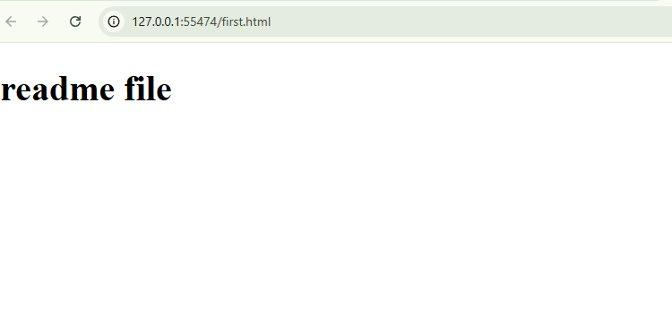

# Welcome to red and white

this is my first project

## HTML
sdfkhsdfksdhfkdshfhjsd
* frontend
* backend
* full stack
_italic text
__testing

## CSS
- item1
- item2
- item3

## copy code
```bash
git add . 
```

```bash
git commit -m "testing"
```

**END**

---

## create table

| Name     | Age | Role        |
|----------|-----|-------------|
| Alice    | 24  | Developer   |
| Bob      | 29  | Designer    |
| Charlie  | 32  | Team Lead   |

*italic*
**bold**
***italic and bold***

### screenshot


<h2>This is an H2 tag using HTML</h2>
<p>This is a paragraph with <strong>bold</strong> and <em>italic</em> text.</p>
